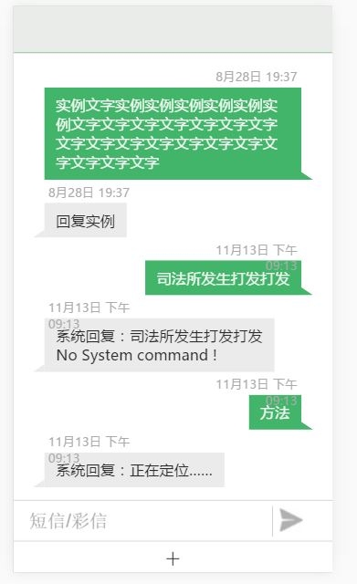
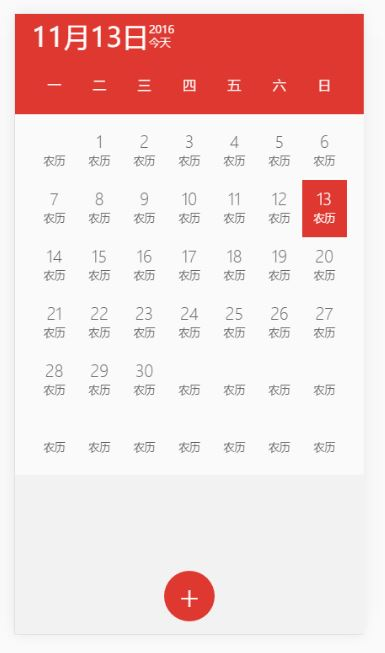
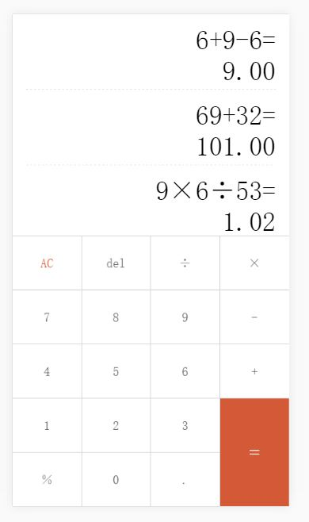
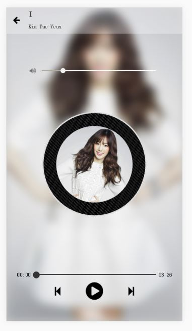
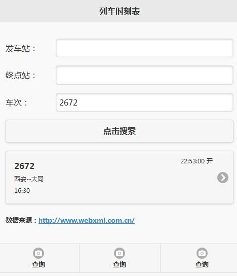
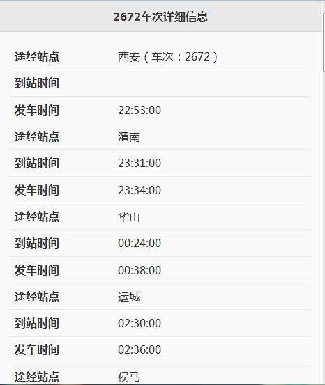

>##WebAPP应用（以下网页均得在移动端预览或打开F12控制台调试手机模式查看）

1. 模仿魅族发送短信
[预览](https://rawgit.com/Yangfan2016/PersonalWorks/master/webapp/%E6%A8%A1%E4%BB%BF%E5%8F%91%E9%80%81%E7%9F%AD%E4%BF%A1/index.html)

=====================================================

1. 模仿魅族日历
[预览](https://rawgit.com/Yangfan2016/PersonalWorks/master/webapp/%E6%A8%A1%E4%BB%BF%E9%AD%85%E6%97%8F%E6%97%A5%E5%8E%86/index.html)

=====================================================

1. 模仿小米计算器
[预览](https://rawgit.com/Yangfan2016/PersonalWorks/master/webapp/%E6%A8%A1%E4%BB%BF%E8%AE%A1%E7%AE%97%E5%99%A8/index.html)

=====================================================

1. 音乐播放器
[预览](https://rawgit.com/Yangfan2016/PersonalWorks/master/webapp/%E9%9F%B3%E4%B9%90%E6%92%AD%E6%94%BE%E5%99%A8/index.htm)

=====================================================

1. 列车时刻表(jQuery-Mobile)
[预览](https://rawgit.com/Yangfan2016/PersonalWorks/master/webapp/%E5%88%97%E8%BD%A6%E6%97%B6%E5%88%BB%E8%A1%A8/index.html)

=====================================================

1. 腾讯视频(zeptojs)
[预览](https://cdn.rawgit.com/Yangfan2016/PersonalWorks/39197626/webapp/%E6%A8%A1%E4%BB%BF%E8%85%BE%E8%AE%AF%E8%A7%86%E9%A2%91/index.html)

