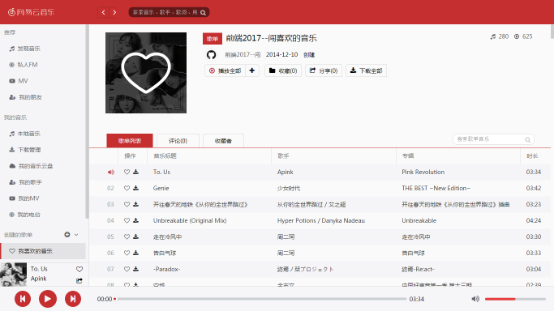
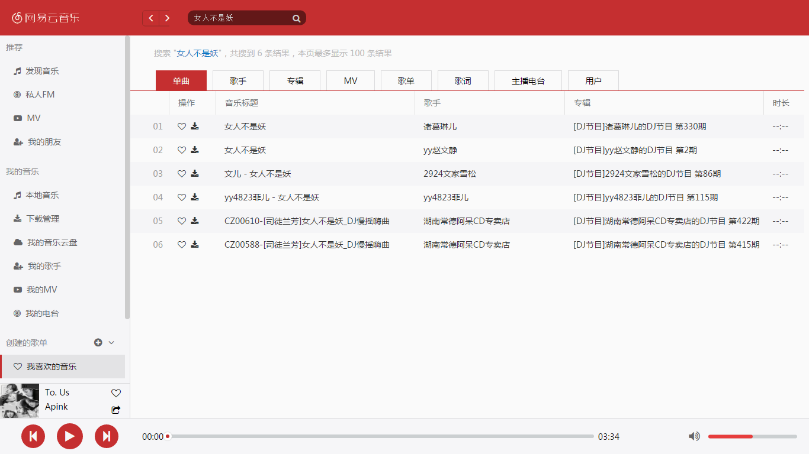
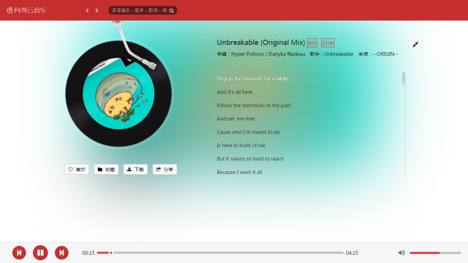
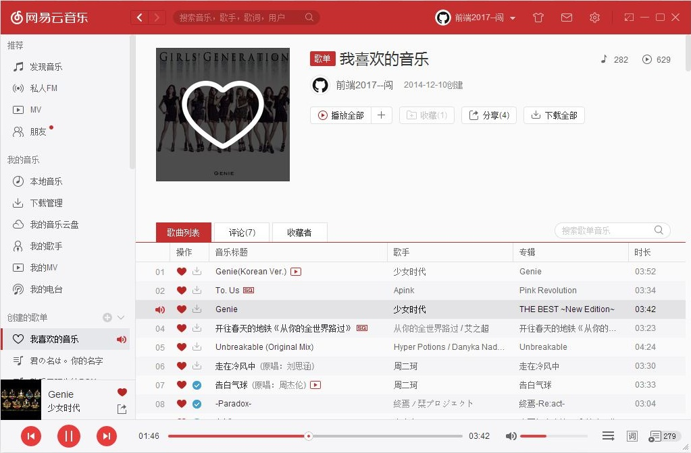

 HTML+CSS+JAVASCRIPT 高仿低配网页版网易云音乐播放器
======

#### 写在前头的话

鄙人野生前端一只，gis专业，自学前端已经一年多了，为什么要写个音乐播放器呢？原因有两个：  
1. 本人是网易云音乐的重度用户，近乎疯狂  
2. 自学了前端这么久了，也是想检验下自己的成果吧

#### 本播放器要干什么呢

1. 简单的 **播放** **暂停** 那当然不能少
2. 切换歌曲，**上一首** 、 **下一首** 也得有
3. **进度条** ，这个有点复杂，本来想用 input[range] 写，但是样式不好改，自己用多个div代替吧
4. 进度条都有了，**音量调节** 不能少吧，毕竟他俩UI样式差不多，照猫画虎呗
5. 再加一个 **静音功能** ，省的音乐太大声，邻居找茬哦(⊙o⊙)

#### 本播放器还能干什么呢

1. **歌词滚动** 有木有
2. **搜索单曲** 
3. **指定歌单播放**  这个需要知道歌单的 id 不是很好找，（得上[网易云音乐官网](http://music.163.com )登录自己的账号，找到歌单，点进去，抬头看URL 里最后的 id 参数）暂时用的是“我喜欢的音乐”（歌单）的id

#### 那闲话不多说，开整吧（原谅一个理科生的表达能力）

我模仿的是网易云音乐的PC端，所用到的技术都是前端的基本技术 HTML、CSS、JAVASCRIPT  
由于我是自学的，没有那么多规矩，我这个人看到是我感兴趣的，我立马就会去做，这个播放器也不例外。

> 首先先的将它“画”出来（HTML+CSS）

我仔细看了下网易云音乐PC端的布局，大致分为四部分，四个模块

1. 顶部菜单（顶部导航，叫什么名无所谓了）
2. 底部播放条 这是播放器的核心
3. 主体内容在右边 歌单的详细信息和歌曲列表
4. 左侧是导航和歌单组
5. 左下角还有一个小窗，显示正在播放歌曲的简要信息，点击小窗 展开一个歌曲详情页

无图不真相

> 然后呢，写页面逻辑JavaScript

#### 播放器

1. 播放器的控制按钮
播放(暂停)按钮，这个可以通过` play() `和` pause()`方法实现
2. 进度条
这个通过监听`timeupdate`事件，实施更新当前播放位置，
通过监听鼠标移动事件，改变进度条的长度
3. 静音按钮，可以通过`audio.muted=true`实现

#### 初始化歌单列表

网易云音乐获取歌单的API 
http://music.163.com/api/playlist/detail?id=[id]

	id 歌单id

因为涉及到跨域问题。暂时我前台这边又没有办法跨域，所以参考了网上的代码，写个PHP做代理，这样就不存在跨域问题了。
获取到歌单数据后，重新渲染下DOM

#### 搜索歌曲

网易云音乐获取歌曲的API  
http://s.music.163.com/search/get?s=[songname]&type=1&limit=10

	s           搜索内容
	type        搜索类型
	limit       搜索返回结果数

#### 歌曲详情页

主要是歌词和歌词滚动

网易云音乐获取歌词API  
http://music.163.com/api/song/lyric?os=pc&id=[id]

	id 歌曲id

歌词滚动，先把获取到的歌词数据分割成时间点和歌词两部分，将这两部分存入dataset中，
通过监听timeupdate事件，判断和当前播放时间相近的歌词，记录它的getBoundingClient()的top值，将滚动条设置到指定位置 例如：`ele.srcollTop=100;`

#### 先写到这里吧

总结能力太差了，原谅理科生的无奈
